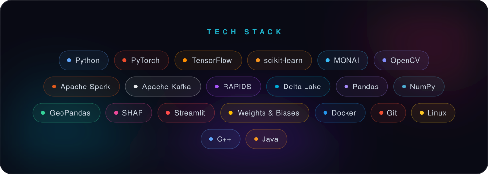
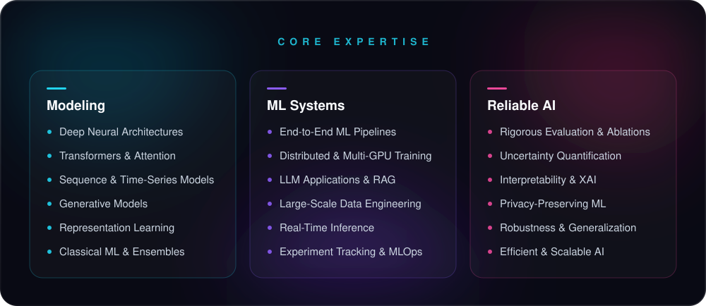
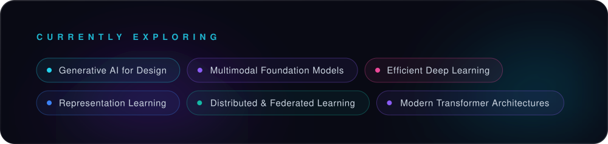

<!-- ═════════════════════════ HERO ═════════════════════════ -->
<p align="center"><a></a></p>

<!-- ═════════════════════════ ABOUT ═════════════════════════ -->
<p align="center"><a></a></p>

```yaml
# ── model_card.yaml ──────────────────────────────────────────────
model_id:        noor-fatima
pipeline_tag:    ai-ml-engineering
architecture:    deep-learning × systems-engineering
trained_on:      [deep learning, LLM systems, multimodal AI,
                  distributed training, privacy-preserving ML]
inference:       research → prototype → production
serving_layer:   full-stack web · React · TypeScript · FastAPI · WebSockets
fine_tuning_on:  SpatioArchitect · satellite image + one sentence → 3D house
license:         open-to-opportunities
```

<!-- ═════════════════════════ TECH STACK ═════════════════════════ -->
<p align="center"><a></a></p>

<!-- ═════════════════════════ FEATURED WORK ═════════════════════════ -->
<p align="center"><a></a></p>

<details>
<summary><b>🫀 CortexPI &nbsp;—&nbsp; Federated ICU Deterioration Intelligence</b></summary>
<br>

> **A real-time, privacy-preserving clinical AI platform that predicts ICU patient deterioration across distributed hospital nodes — without a single patient record ever leaving its source hospital.** Engineered end-to-end across streaming data infrastructure, custom GPU kernels, state-of-the-art sequence models and federated optimization.

```text
┌──────────────────────────────────────────────────────────────────────────────────┐
│                         CortexPI  ·  System Architecture                         │
├──────────────────────────┬──────────────────────────┬────────────────────────────┤
│     STREAM INGESTION     │  GPU STREAM PROCESSING   │     FEDERATED TRAINING     │
│                          │                          │                            │
│  Apache Kafka            │  RAPIDS cuDF + Spark     │  FedAvg + Differential     │
│  exactly-once semantics  │  Structured Streaming    │  Privacy · 5 hospital      │
│  live vitals + ECG feeds │  Delta Lake lakehouse    │  nodes · torchrun 2×T4     │
├──────────────────────────┴──────────────────────────┴────────────────────────────┤
│                                DEEP LEARNING CORE                                │
│                                                                                  │
│      Mamba SSM ECG Encoder  ·  GRU-D Vitals Encoder  ·  Graph Attention Net      │
│         Custom Triton Pan-Tompkins GPU Kernel  ·  EWC Continual Learning         │
│               Conformal Prediction  ·  3 Clinical Prediction Heads               │
├──────────────────────────────────────────────────────────────────────────────────┤
│      OUTPUT → real-time deterioration risk + calibrated uncertainty bounds       │
├──────────────────────────────────────────────────────────────────────────────────┤
│  Data: PhysioNet 2012 · PTB-XL        Compute: Apple M2 Pro · Kaggle dual-T4     │
└──────────────────────────────────────────────────────────────────────────────────┘
```

**⚡ Highlights**

- **Mamba state-space ECG encoder** for long-range cardiac sequence modeling — outperforms LSTM baselines on irregular clinical time series
- **GRU-D vitals encoder** with learned missingness decay, built for the extreme sparsity of real ICU data
- **Custom Triton GPU kernel** running Pan-Tompkins QRS detection fully on-GPU — zero CPU round-trips
- **FedAvg + Differential Privacy** across 5 hospital nodes with formal (ε, δ) privacy guarantees
- **Graph Attention Network** modeling relational structure across clinical signals, driving **3 clinical prediction heads**
- **EWC continual learning** that defends against catastrophic forgetting as patient populations drift
- **Conformal prediction** wrapping every risk score in calibrated, distribution-free uncertainty bounds
- **2-GPU pipeline parallelism** via `torchrun` on dual-T4 infrastructure, fed by an exactly-once Kafka → Spark → Delta Lake stream

**Stack** &nbsp; `PyTorch` · `Mamba SSM` · `Triton` · `RAPIDS cuDF` · `Apache Spark` · `Apache Kafka` · `Delta Lake` · `Federated Learning`

</details>

<details>
<summary><b>🔎 AcademIQ &nbsp;—&nbsp; Evidence-Grounded AI Search Engine</b></summary>
<br>

> **A production-grade Big Data retrieval and question-answering engine that turns dense university policy handbooks into a fast, auditable natural-language knowledge system.** Fuses approximate similarity search, multi-stage ranking, distributed indexing, query mining and grounded LLM synthesis — every answer ships with its source, section and page.

```text
                     ┌───────────────────────────────────┐
                     │      Query Cache · LRU + TTL      │
  User Query ───────►│    thread-safe · < 1 ms on hit    │── hit ──► Answer
                     │    warmed by SON query mining     │
                     └─────────────────┬─────────────────┘
                                       │ miss
            ┌──────────────────────────┼──────────────────────────┐
            ▼                          ▼                          ▼
  ┌───────────────────┐      ┌───────────────────┐      ┌───────────────────┐
  │      TF-IDF       │      │   MinHash + LSH   │      │      SimHash      │
  │   exact lexical   │      │  sub-linear ANN   │      │  near-duplicate   │
  │ precision anchor  │      │ candidate search  │      │  fingerprinting   │
  └─────────┬─────────┘      └─────────┬─────────┘      └─────────┬─────────┘
            │                          │                          │
            └──────────────────────────┼──────────────────────────┘
                                       ▼
                    ┌─────────────────────────────────────┐
                    │    Reciprocal Rank Fusion (RRF)     │
                    │   Re-ranking · Diversity Control    │
                    └──────────────────┬──────────────────┘
                                       ▼
                    ┌─────────────────────────────────────┐
                    │       Grounded LLM Synthesis        │
                    │   evidence-constrained generation   │
                    │         extractive fallback         │
                    └──────────────────┬──────────────────┘
                                       ▼
                   Answer · Source · Section · Page · Latency

  ┄┄┄┄┄┄┄┄┄┄┄┄┄┄┄┄┄┄┄┄┄┄┄┄┄┄┄┄┄┄┄┄┄┄┄┄┄┄┄┄┄┄┄┄┄┄┄┄┄┄┄┄┄┄┄┄┄┄┄┄┄┄┄┄┄┄┄┄┄┄┄┄┄┄
    Offline: MapReduce-parallel index builds  ·  SON frequent-pattern mining
```

**⚡ Highlights**

- **7× faster retrieval** than exact TF-IDF — while **recovering +6 pp precision** through hybrid retrieval and re-ranking
- **54 ms retrieval at 10× corpus scale** — approximate search held firmly in the sub-100 ms regime
- **Reciprocal Rank Fusion** of TF-IDF, MinHash-LSH and SimHash into a single unified relevance ranking
- **Hallucination-resistant LLM synthesis** constrained strictly to retrieved evidence, with an extractive fallback
- **MapReduce-style parallel indexing** for the compute-heavy retrieval indexes
- **SON frequent-pattern mining** to discover recurring query patterns and pre-warm the cache
- **Thread-safe LRU + TTL cache** delivering **< 1 ms** responses on repeated queries

**Stack** &nbsp; `Python` · `scikit-learn` · `MinHash LSH` · `SimHash` · `MapReduce` · `OpenAI API` · `Streamlit`

</details>

<details>
<summary><b>🧠 3D Brain Tumor Segmentation &nbsp;—&nbsp; Multi-Modal MRI · MONAI 3D U-Net</b></summary>
<br>

> **A volumetric deep-learning pipeline that fuses four complementary MRI sequences — T1, T1ce, T2 and FLAIR — to deliver voxel-precise, multi-class brain tumor segmentation with a compact MONAI 3D U-Net.**

```text
    ┌───────────────────────────────────┐
    │   BraTS 2020 · Multi-Modal MRI    │
    │   T1  ·  T1ce  ·  T2  ·  FLAIR    │
    └─────────────────┬─────────────────┘
                      │  4-channel volumetric fusion
                      ▼
    ┌───────────────────────────────────┐
    │         3D Preprocessing          │
    │ Intensity norm · Label remapping  │
    │ Foreground-biased patch sampling  │
    └─────────────────┬─────────────────┘
                      │  96³ voxel patches
                      ▼
    ┌───────────────────────────────────┐
    │          MONAI 3D U-Net           │
    │         4.8 M parameters          │
    │         Dice + Focal loss         │
    └─────────────────┬─────────────────┘
                      │  sliding-window inference
                      ▼
    ┌───────────────────────────────────┐
    │     4-Class Voxel Prediction      │
    │  Background · NCR/NET · ED · ET   │
    └─────────────────┬─────────────────┘
                      │  patient-level held-out split
                      ▼
    ┌───────────────────────────────────┐
    │  Quantitative + Qualitative Eval  │
    │      55 validation patients       │
    └───────────────────────────────────┘
```

**⚡ Highlights**

- **0.6479 mean validation Dice** across **55 held-out patients**
- **0.7652 Dice on Enhancing Tumor** — the clinically critical sub-region and the model's strongest class
- **4-modal 3D MRI fusion** into a single volumetric input for voxel-level reasoning
- **Compact 4.8 M-parameter 3D U-Net** trained with a hybrid **Dice + Focal loss** to defeat extreme class imbalance
- **Foreground-biased 96³ patch sampling** + **sliding-window inference** for full-volume prediction
- **Leak-proof evaluation** — strict patient-level splits, independent validation, fully tracked in W&B

**Stack** &nbsp; `PyTorch` · `MONAI` · `3D U-Net` · `BraTS 2020` · `Weights & Biases`

</details>

<details>
<summary><b>🏙️ London Crime Predictive Intelligence &nbsp;—&nbsp; Geospatial Risk Engine</b></summary>
<br>

> **A city-scale geospatial intelligence platform that forecasts crime risk across every London neighbourhood (LSOA)** — fusing census, socio-economic, POI and temporal signals into an ensemble ML engine, explained with SHAP and rendered as an interactive **3D digital twin** with live what-if policy simulation.

```text
                 ┌───────────────────────────────────────┐
                 │           DATA FUSION LAYER           │
                 │  Census · Crime Records · Geography   │
                 │   POIs · Socio-economic · Temporal    │
                 └───────────────────┬───────────────────┘
                                     ▼
                 ┌───────────────────────────────────────┐
                 │       FEATURE ENGINEERING & EDA       │
                 │     LSOA-level joins · Imputation     │
                 │      Spatial + temporal features      │
                 └───────────────────┬───────────────────┘
                  ┌──────────────────┴──────────────────┐
                  ▼                                     ▼
    ┌───────────────────────────┐         ┌───────────────────────────┐
    │      CLASSIFICATION       │         │        REGRESSION         │
    │  XGBoost · Random Forest  │         │  Random Forest Regressor  │
    │   Low / Med / High risk   │         │   Continuous risk score   │
    │       83% accuracy        │         │          0.95 R²          │
    └─────────────┬─────────────┘         └─────────────┬─────────────┘
                  └──────────────────┬──────────────────┘
                                     ▼
                 ┌───────────────────────────────────────┐
                 │            EXPLAINABLE AI             │
                 │    SHAP per-prediction attribution    │
                 └───────────────────┬───────────────────┘
                                     ▼
                 ┌───────────────────────────────────────┐
                 │    INTERACTIVE INTELLIGENCE LAYER     │
                 │      3D Geospatial Digital Twin       │
                 │      What-If Scenario Simulation      │
                 │      Before / After Risk Deltas       │
                 └───────────────────────────────────────┘
```

**⚡ Highlights**

- **83% accuracy** classifying Low / Medium / High risk with XGBoost
- **0.95 R²** on continuous risk-score regression with a Random Forest ensemble
- **3D geospatial digital twin** of London's LSOA geography built in PyDeck
- **What-if scenario engine** — perturb socio-economic levers and quantify the before/after risk delta in real time
- **SHAP explainability** surfacing the exact drivers behind every individual prediction
- **Decision-grade Streamlit dashboard** unifying 3D maps, model switching, simulation and explanations

**Stack** &nbsp; `XGBoost` · `scikit-learn` · `SHAP` · `GeoPandas` · `PyDeck` · `Plotly` · `Streamlit`

</details>

<details>
<summary><b>🏗️ SpatioArchitect &nbsp;—&nbsp; Satellite Image + One Sentence → Walkable 3D House</b></summary>
<br>

**🚧 In Progress &nbsp;·&nbsp; Final Year Project &nbsp;·&nbsp; 3-person team**

> **Give it a satellite image of a real plot and one sentence — *“3-bedroom modern house with 2 bathrooms”* — and it generates a boundary-compliant, fully furnished 3D house you can walk through and edit in the browser.** Neural networks do what learning is best at — reading imagery and proposing architectural layouts — while deterministic, oracle-checked geometry owns everything a user can stand inside.

```text
     Satellite image of the plot               "3-bed modern house, 2 baths"
                 ▼                                          ▼
  ┌─────────────────────────────┐            ┌─────────────────────────────┐
  │         1 · VISION          │            │      2 · BRIEF → GRAPH      │
  │   SAM 2 plot segmentation   │            │ program + feasibility gate  │
  │ GSD metric scale · setback  │            │    bubble-diagram prior     │
  └──────────────┬──────────────┘            └──────────────┬──────────────┘
                 └────────────────────┬─────────────────────┘
                                      ▼
                   ┌─────────────────────────────────────┐
                   │    3 · BOUNDARY-GUIDED DIFFUSION    │
                   │   HouseDiffusion + training-free    │
                   │      clean-estimate projection      │
                   └──────────────────┬──────────────────┘
                                      ▼
                   ┌─────────────────────────────────────┐
                   │    4 · CONSTRUCTION + FURNISHING    │
                   │    3D shell · fixture manifests     │
                   │ SAT collision · circulation oracle  │
                   └──────────────────┬──────────────────┘
                                      ▼
                   ┌─────────────────────────────────────┐
                   │      5 · WALKTHROUGH + EDITOR       │
                   │       first-person navigation       │
                   │     every edit oracle-validated     │
                   └──────────────────┬──────────────────┘
                                      ▼
               Furnished · walkable · editable 3D house  →  glTF
```

**⚡ Highlights**

- **Training-free boundary-guided diffusion** — projects HouseDiffusion's clean estimate onto boundary-compliant layouts *inside* the sampling loop, so plans fit real, non-convex parcels with zero retraining
- **Zero-shot plot extraction with SAM 2** — Web-Mercator GSD calibration turns map pixels into real metres, with construction setbacks applied automatically
- **Semantically complete interiors** — declarative fixture manifests (every bathroom gets its toilet, sink and tub/shower), plumbing-aware wet-wall anchoring and exact SAT collision checks
- **Provable navigability** — a morphological circulation oracle guarantees a ≥ 60 cm path to every door and fixture
- **One geometric oracle** shared by generation, editing and evaluation — the house can never be edited into an invalid state
- **90.4% boundary IoU** already achieved by the proof of concept on rectangular plots
- **Research-grade evaluation** — 100-plot stratified benchmark against 4 baselines, paired Wilcoxon + Holm statistics, ablations and a user study

**My focus** &nbsp; Built together as a team; my core area is Deep Learning & Mathematical Modelling.

**Stack** &nbsp; `PyTorch` · `HouseDiffusion` · `SAM 2` · `Shapely` · `trimesh` · `glTF` · `FastAPI` · `React` · `three.js` · `Docker`

</details>

<br>

<!-- ═════════════════════════ EXPERTISE ═════════════════════════ -->
<p align="center"><a></a></p>

<!-- ═════════════════════════ EXPLORING ═════════════════════════ -->
<p align="center"><a></a></p>

<!-- ═════════════════════════ ANALYTICS ═════════════════════════ -->
<p align="center"><a></a></p>

<p align="center">
  <a></a>
  <a></a>
</p>
<p align="center">
  <a></a>
</p>

<!-- ═════════════════════════ FOOTER ═════════════════════════ -->
<p align="center">
  <a href="https://portfolio-nooorfs-projects.vercel.app/"></a>
  <a href="https://www.linkedin.com/in/noorfatima4428/"></a>
  <a href="mailto:nfatima.bscs23seecs@seecs.edu.pk"></a>
</p>

<p align="center"><a></a></p>
